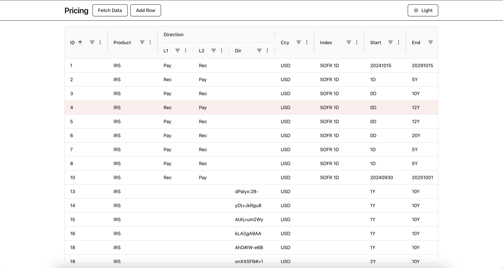

# AG Grid Pricing Example

A simple AG Grid example using mock pricing data.



##  Getting Started

Copy your AG Grid License key into the `.env` file.

```bash
cp .env.example .env
npm install
npm run dev
```

To run unit tests

```bash
npm run test
```
